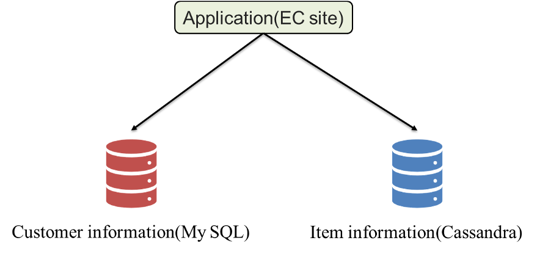
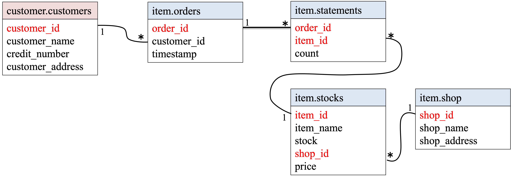

# ryo-hu ScalarDB Application  

This document describes an application using ScalarDB created by the team ryo-hu.

## Prerequisites

- Java
- Python (Tkinter must be available)
- Gradle (version 8.2)
- Docker, Docker Compose
- MySQL
- Cassandra

## application

### Overview

We have modified the distribution sample ([multi-storage-transaction-sample](https://github.com/scalar-labs/scalardb-samples/tree/main/multi-storage-transaction-sample)) to create an application that simulates an e-commerce site. 
As we are using Python's Tkinter for the GUI, Python environment is required. 
As for the database application running under ScalarDB, we are using MySQL and Cassandra, just like the sample. 
Moreover, when we executed the sample program, multiple errors were output on the terminal.
Then, we added the SLF4J binder and log4j configuration file to remove them.



### Schema
```json
{
  "customer.customers": {
    "transaction": true,
    "partition-key": [
      "customer_id"
    ],
    "columns": {
      "customer_id": "INT",
      "name": "TEXT",
      "credit_number": "INT",
      "customer_address": "INT"
    }
  },
  "item.orders": {
    "transaction": true,
    "partition-key": [
      "customer_id"
    ],
    "clustering-key": [
      "timestamp"
    ],
    "secondary-index": [
      "order_id"
    ],
    "columns": {
      "order_id": "TEXT",
      "customer_id": "INT",
      "timestamp": "BIGINT"
    }
  },
  "item.statements": {
    "transaction": true,
    "partition-key": [
      "order_id"
    ],
    "clustering-key": [
      "item_id"
    ],
    "columns": {
      "order_id": "TEXT",
      "item_id": "INT",
      "count": "INT"
    }
  },
  "item.stocks": {
    "transaction": true,
    "partition-key": [
      "item_id"
    ],
    "columns": {
      "item_id": "INT",
      "name": "TEXT",
      "price": "INT",
      "shop_id": "INT",
      "stock": "INT"
    }
  },
  "item.shops": {
    "transaction": true,
    "partition-key": [
      "shop_id"
    ],
    "columns": {
      "shop_id": "INT",
      "shop_name": "TEXT",
      "shop_address": "INT"
    }
  }
}
```

All the tables are created in the `customer` and `item` namespaces.

- `customer.customers`: a table that manages customers' information
- `item.orders`: a table that manages order information
- `item.statements`: a table that manages order statement information
- `item.stocks`: a table that manages information of items' stock
- `item.shops`: a table that manages shop information

The Entity Relationship Diagram for the schema is as follows:



### functions

The following six functions are implemented in this application:

1. Getting customer information (GUI)
2. Compare prices at different stores for the same product (GUI)
3. Increase item stock in shop (GUI)
4. Register item in stock (GUI)
5. Getting item information in shop
6. Decrease item stock by order

## Configuration

Configurations for the sample application are as follows:

```properties
scalar.db.storage=multi-storage
scalar.db.multi_storage.storages=cassandra,mysql
scalar.db.multi_storage.storages.cassandra.storage=cassandra
scalar.db.multi_storage.storages.cassandra.contact_points=localhost
scalar.db.multi_storage.storages.cassandra.username=cassandra
scalar.db.multi_storage.storages.cassandra.password=cassandra
scalar.db.multi_storage.storages.mysql.storage=jdbc
scalar.db.multi_storage.storages.mysql.contact_points=jdbc:mysql://localhost:3306/
scalar.db.multi_storage.storages.mysql.username=root
scalar.db.multi_storage.storages.mysql.password=mysql
scalar.db.multi_storage.namespace_mapping=customer:mysql,item:cassandra,coordinator:cassandra
scalar.db.multi_storage.default_storage=cassandra
```

## Setup

### Start Application

Just by executing the following command, the database starts up, the initial data is loaded, and the application launches.

```shell
$ python gui.py
```

This is because the Python program is executing the following three commands.

```shell
$ docker-compose up -d
$ java -jar scalardb-schema-loader-<VERSION>.jar --config database.properties --schema-file schema.json --coordinator
$ ./gradlew run --args="LoadInitialData"
```

### initial data

The following records are stored in the tables:

- For the `customer.customers` table:

| customer_id | name           | credit_number | customer_address |
|-------------|----------------|---------------|------------------|
| 1           | Naoi Tomoki    | 1122          | 123              |
| 2           | Murakami Ryuta | 3344          | 456              |
| 3           | Murata Kijun   | 5566          | 789              |

- For the `item.stocks` table:

| item_id | name     | price | shop_id | stock |
|---------|----------|-------|---------|-------|
| 1       | Mac      | 1000  | 1       | 1     |
| 2       | WinPC    | 2000  | 2       | 2     |
| 3       | WinPC    | 2500  | 1       | 3     |
| 4       | Mouse    | 5000  | 2       | 2     |
| 5       | Keyboard | 3000  | 1       | 1     |

- For the `item.shops` table:

| item_id | shop_name | shop_address |
|---------|-----------|--------------|
| 1       | kojima    | 135          | 
| 2       | bigcamera | 246          | 

## Run the application

To get customer information, enter the customer ID in the window on the left.
It executes the following commands internally and outputs the results.

```shell
$ ./gradlew run --args="GetCustomerInfo 1"
...
{"id": 1, "name": "Naoi Tomoki", "credit_number": 1122, "customer_address": 123}
...
```

To compare prices at different stores for the same product, enter the name of the product in the middle window.
It executes the following commands internally and outputs the results.

```shell
$ ./gradlew run --args="GetItemInfo WinPC"
...
[{"name": "WinPC", "price": 2000, "shop_id": 2, "stock": 2}, {"name": "WinPC", "price": 2500, "shop_id": 1, "stock": 3}]
...
```

To increase item stock in shop, enter the product ID and the number to be increased in the upper right window.
It executes the following commands internally and outputs the results.
An error is output on the GUI if a non-existent product name is entered.

```shell
$ ./gradlew run --args="IncreaseItemStock WinPC 5"
```

To register item in stock, enter the product ID, product name, price, ID of the store that has the product in stock, and the number of items in stock in the lower right window.
It executes the following commands internally and outputs the results.
If there are duplicate IDs, an error is output on the GUI.

```shell
$ ./gradlew run --args="AddItemCommand 6 LinuxPC 2000 1 5"
```

To get item information in shop, enter the following command on the terminal.

```shell
$ ./gradlew run --args="GetItemsByShopId 1"
```

To decrease item stock by order, enter the following command on the terminal.

```shell
$ ./gradlew run --args="PlaceOrder 1 1:2"
```

## Clean up

To stop Cassandra and MySQL, run the following command:

```shell
$ docker-compose down
```
